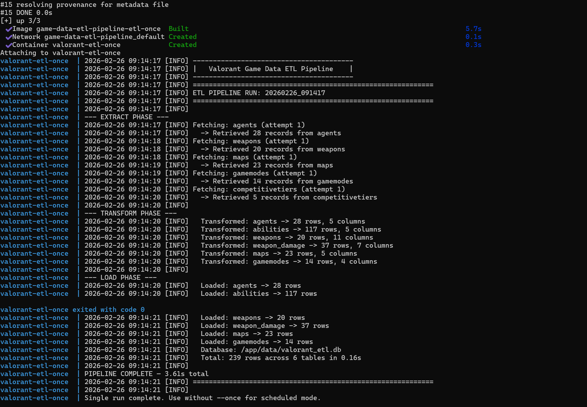

# VALORANT GAME DATA ETL PIPELINE

A Dockerized ETL (Extract, Transform, Load) pipeline that pulls live Valorant game data from an API, transforms it into analysis ready tables and loads it into a SQLite database with configurable scheduling and comprehensive logging.



## PROJECT OVERVIEW

Game studios need automated data pipelines to keep analytics databases current. This project implements a production style ETL pipeline that:

1. **Extracts** agent, weapon, map and game mode data from the Valorant API
2. **Transforms** raw JSON into clean, normalized DataFrames
3. **Loads** results into a SQLite database with ETL run tracking
4. **Runs on a schedule** (configurable) or as a one shot job
5. **Deploys via Docker** for consistent, portable execution

## PIPELINE ARCHITECTURE

```
--------------------     --------------------     --------------------
│     EXTRACT      │---> |  TRANSFORM       │---> │      LOAD        |
│                  │     │                  │     │                  │
│ • Valorant API   │     │ • Clean JSON     │     │ • SQLite DB      │
│ • 5 endpoints    │     │ • Normalize data │     │ • 6 tables       │
│ • Retry logic    │     │ • Build DFs      │     │ • ETL metadata   │
│ • Rate limiting  │     │ • Type casting   │     │ • Run tracking   │
--------------------     --------------------     --------------------
         │                                                 │
         ------------- Orchestrated by ETLPipeline ---------
                         Runs in Docker container
                          Configurable via JSON
```

## FEATURES

### ETL Pipeline
- **Multi-endpoint extraction** with retry logic (3 attempts with exponential backoff)
- **Rate limiting** with configurable delays between API calls
- **Clean transformations** producing 6 normalized tables: agents, abilities, weapons, weapon_damage, maps, gamemodes
- **Full refresh strategy** - each run replaces table contents for consistency
- **ETL run tracking** - every run is logged in an `etl_runs` metadata table with timestamps, row counts and duration
- **Comprehensive logging** to both file and console

### Docker Support
- **Lightweight image** built on `python:3.12-slim`
- **Docker Compose** with two modes: single run (`etl-once`) and scheduled (`etl-scheduled`)
- **Volume mounting** for persistent database and log storage
- **Health check** built into the Dockerfile
- **Read only config** mount for security

### Configuration
- All settings externalized to `pipeline_config.json`
- Configurable: API endpoints, schedule interval, database path, log level
- Separate paths for Docker and local execution (auto detected)

## OUTPUT TABLES

| Table | Rows | Description |
|-------|------|-------------|
| `agents` | 28 | Agent name, role, description, icon |
| `abilities` | 117 | All agent abilities with slot and description |
| `weapons` | 20 | Weapon stats, cost, fire rate, accuracy |
| `weapon_damage` | 37 | Damage ranges (head/body/leg by distance) |
| `maps` | 23 | Map metadata and callout counts |
| `gamemodes` | 14 | Game mode properties |
| `etl_runs` | 1+ | Pipeline execution history and metrics |

## TOOLS AND TECHNOLOGIES

- **Python 3.12** - pipeline language
- **pandas** - data transformation
- **requests** - API communication with retry logic
- **SQLite** - lightweight embedded database
- **schedule** - Python job scheduling
- **Docker** - containerization
- **Docker Compose** - multi service orchestration

## PROJECT STRUCTURE

```
game-data-etl-pipeline/
├── etl/
│   └── pipeline.py              # Complete ETL pipeline (Extract, Transform, Load)
├── config/
│   └── pipeline_config.json     # All pipeline settings
├── data/                        # Output database and logs (gitignored)
├── images/                      # Screenshots for README
├── Dockerfile                   # Container build instructions
├── docker-compose.yml           # Multi-mode orchestration
├── requirements.txt             # Python dependencies
└── README.md
```

## GETTING STARTED

### Prerequisites
- Python 3.10+ (for local runs)
- Docker Desktop (for containerized runs)

### Run Locally
```bash
git clone https://github.com/rush2pranav/game-data-etl-pipeline.git
cd game-data-etl-pipeline

pip install -r requirements.txt

# single run
python etl/pipeline.py --once

# scheduled mode (runs every 6 hours)
python etl/pipeline.py
```

### Run with Docker
```bash
# single run
docker compose up etl-once --build

# scheduled mode (runs every 6 hours, restarts automatically)
docker compose up etl-scheduled --build -d

# view logs
docker compose logs -f etl-scheduled

# stop
docker compose down
```

### Verify the Database
After a run, you can inspect the SQLite database:
```bash
python -c "
import sqlite3, pandas as pd
conn = sqlite3.connect('data/valorant_etl.db')
for table in pd.read_sql('SELECT name FROM sqlite_master WHERE type=\"table\"', conn)['name']:
    count = pd.read_sql(f'SELECT COUNT(*) as n FROM {table}', conn)['n'][0]
    print(f'  {table:20s} {count:>5} rows')
conn.close()
"
```

## WHAT I LEARNED

- **ETL is about reliability, not complexit** - The core logic is straightforward, but retry handling, logging, error recovery and run tracking are what make a pipeline production ready. Most of the code is defensive rather than functional.
- **Docker makes deployment trivial** - The same pipeline runs identically on my machine and in a container with zero configuration changes, thanks to the auto detecting path logic and externalized config.
- **JSON config files beat hardcoded values** - Externalizing all settings to `pipeline_config.json` means the pipeline behavior can be changed without touching code which is exactly how production systems work.
- **Scheduling is simpler than expected** - The `schedule` library combined with a simple while loop creates a reliable job runner in just a few lines, though a production system would use something like Airflow or cron.

## POTENTIAL EXTENSIONS

- Add incremental loading (only update changed records instead of full refresh)
- Integrate with Apache Airflow for enterprise grade orchestration
- Add data quality checks between Transform and Load phases
- Push notifications on pipeline failure (Slack, email)
- Add a second data source (e.g., match history API) with cross source joins
- Deploy to a cloud service (AWS ECS, Azure Container Instances)
- Add unit tests for the Transform layer

## LICENCE

This project is licenced under the MIT Licence - see the [LICENCE](LICENSE) file for details.

---

*Built as part of a Game Data Analytics portfolio. Demonstrates ETL pipeline design, Docker containerization and automation skills. I am open to any and every feedback, please feel free to open an issue or connect with me on [LinkedIn](https://www.linkedin.com/in/phulpagarpranav/).*
